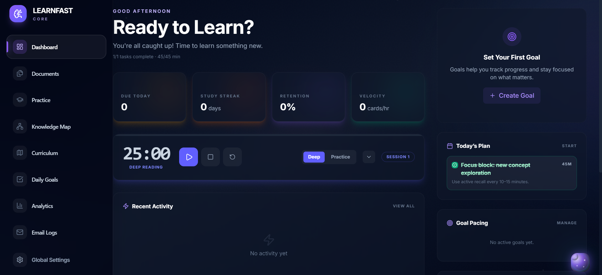
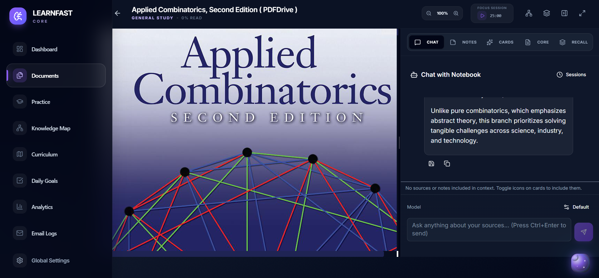
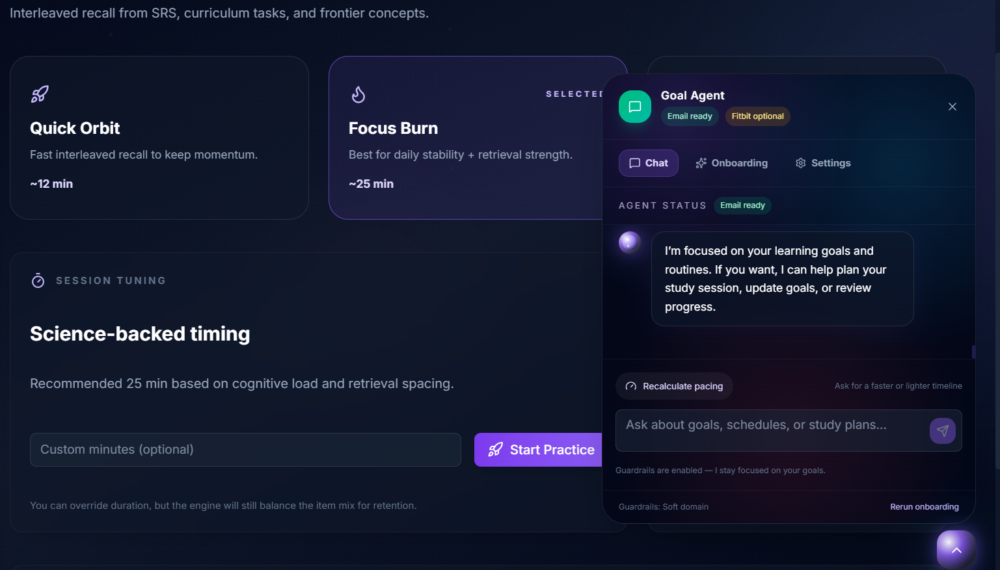
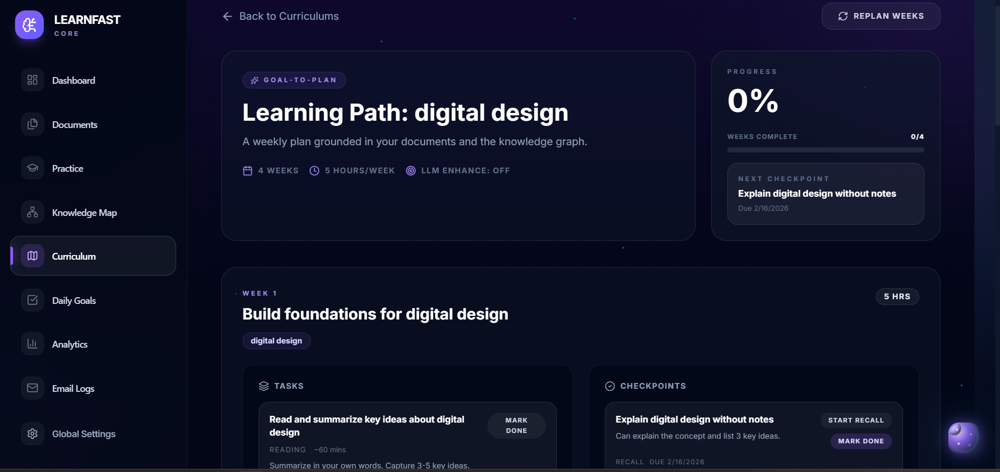
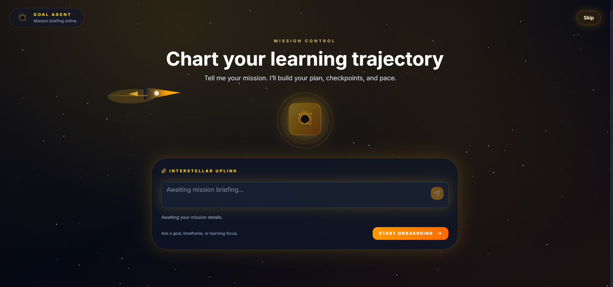

# 🧠 LearnBetter: The AI-Native "Goal-Adaptive" Learning Operating System

> **"Most LMS tools are just digital filing cabinets. LearnBetter is your personal cognitive architect, powered by Hybrid Graph-RAG and Neuro-Biometric feedback."**

LearnBetter is an AI-native learning system that doesn't just store notes; it **re-engineers your cognitive workflow**. By combining **Hybrid Graph-RAG**, **Multi-node Autonomous Agents**, and **Biometric Synthesis**, it turns fragmented source material into a personalized, goal-aligned learning journey backed by rigorous cognitive science.

---

## 🚀 The "Wow" Factor: What Makes This Different?

While other projects do simple Vector RAG, LearnBetter builds a **living knowledge ecosystem**.

### 1. 🕸️ Prerequisite-Aware Graph-RAG (The Vertical Advantage)
Most RAG systems only find "related facts." LearnBetter uses **Neo4j + pgvector** to map the *structural hierarchy* of knowledge.
- **Hierarchical Retrieval**: Navigates conceptual dependencies so you don't study *Quantum Field Theory* without mastering *Linear Algebra* first.
- **Cross-Document Nexus**: Automatically identifies concept merges and prerequisites across disparate PDFs and sources.

### 2. 🤖 Autonomous Goal Manifestation Agent (GMA)
Our agent doesn't just track progress; it **monitors and negotiates** it.
- **Agentic Proof-of-Work**: The agent uses **Playwright** to autonomously take screenshots of your workspace/URLs to verify goal manifestation and "deep work" evidence.
- **Accountability Negotiation**:missing a milestone triggers an automated email negotiation (via **Resend**) to recalibrate your daily load based on remaining time and goal priority.

### 3. ⌚ Neuro-Biometric Feedback Loop (Fitbit Integration)
Learning is a physical process. LearnBetter synchronizes your load with your biological state.
- **Readiness-Based Pacing**: Syncs with **Fitbit** to calculate a real-time **Readiness Score** based on sleep duration, efficiency, and resting heart rate.
- **Circadian Optimization**: Automatically schedules "Deep Abstraction" sessions during your diurnal cortisol peaks and "Light Review" during metabolic nadirs.

### 4. 🧪 Scientific Mastery Engine (SM-2 & FSRS)
- **Retention Targeting**: A custom Spaced Repetition System (SRS) based on **SM-2 with log-linear scaling**, allowing you to target specific retention rates (e.g., 90%).
- **Memory Stability Index**: Real-time calculation of synaptic decay and retention risk across your entire knowledge graph.

---

## 🛠️ The Architecture of Intelligence

LearnBetter is built on a "Triple-Store" architecture to handle the complexity of human learning.

| Layer | Component | Tech Stack | Purpose |
| :--- | :--- | :--- | :--- |
| **Cognition** | **Graph Engine** | Neo4j | Concept hierarchies & prerequisites |
| **Memory** | **Vector Memory** | pgvector (PostgreSQL) | Semantic context & factual recall |
| **Workflow** | **Open Notebook** | SurrealDB | Decentralized, local-first synced notes |
| **Logic** | **Agentic Layer** | **LangGraph** + Playwright | Autonomous planning, monitoring & negotiation |

---

## 📦 Core Capabilities

<div align="center">
  <h3>Interactive Dashboard</h3>
  
  <br/><br/>
  
  <h3>Document Management & Processing</h3>
  
  <br/><br/>

  <h3>Adaptive Practice Engine</h3>
  
  <br/><br/>

  <h3>Customizable Curriculum</h3>
  
  <br/><br/>

  <h3>Personalised learning</h3>
  
</div>

---

## Architecture (High-Level)
```
Frontend (React + Vite)
  ├─ Dashboard / Analytics / Practice / Docs / Knowledge Graph
  └─ Agent UI (chat + tools + settings)

Backend (FastAPI)
  ├─ Documents, Flashcards, Practice, Curriculum
  ├─ Goals, Daily Plans, Agent + Negotiation
  ├─ Analytics, Dashboard, Fitbit integration
  └─ Knowledge Graph + Navigation

Data Layer
  ├─ PostgreSQL + pgvector
  ├─ Neo4j (concept graph)
  └─ SurrealDB (Open Notebook)
---

  <kbd></kbd>
  <p><i>AI-Generated Curriculum: Concepts mapped from your sources into a logical learning path.</i></p>
</div>

---

## ⚡ Quick Start

### 1) Clone and Configure
```bash
git clone https://github.com/learn-faster/Learn_Better.git
cd Learn_Better
cp .env.example .env
```

### 2) Infrastructure (Docker)
```bash
docker compose up -d
```

### 3) Backend Engine
```bash
uv sync
uv run python main.py
```

### 4) Frontend Interface
```bash
cd frontend
npm install && npm run dev
```

---

## Key Endpoints
- `/api/documents/*` — ingest, parse, recall prompts
- `/api/practice/*` — practice sessions, items, history
- `/api/dashboard/overview` — unified dashboard data
- `/api/analytics/*` — insights and trends
- `/api/goals/*` — goals, daily plans, agent actions
- `/api/fitbit/*` — optional biometric inputs
- `/api/graphs/*` — knowledge graph workflows

---
## Project Map
```
src/
  routers/           # API endpoints
  services/          # domain logic (practice, goals, analytics, agent)
  models/            # ORM + Pydantic schemas
  ingestion/         # document processing
frontend/
  pages/             # Dashboard, Analytics, Practice, Documents
  components/        # Agent UI and shared UI pieces
docs/
  PROJECT_OVERVIEW.md
  PROJECT_UPDATE_SUMMARY.md
```
**LearnFast** — turn goals into daily learning and measurable progress.
