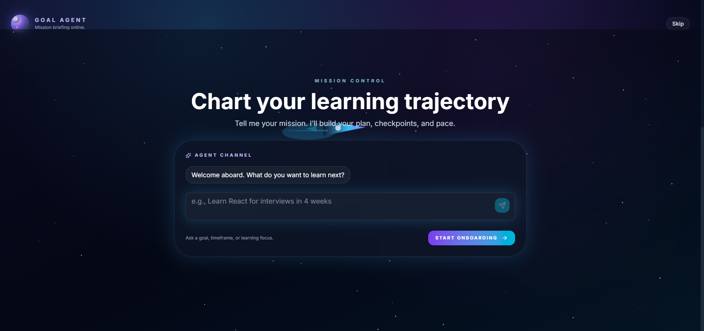

# LearnFast Core Engine

**An AI-powered learning system that turns goals into daily actions, backed by cognitive science and real-time analytics.**

LearnFast Core combines ingestion, knowledge graphs, practice scheduling, and a goal-driven agent into one workflow. It’s designed for learners who want a clear daily plan, measurable progress, and adaptive pacing.

---

## What It Solves
Learning is usually fragmented across notes, videos, and flashcards, with little guidance on **what to do next**. LearnFast Core solves this by turning scattered knowledge into a **goal-aligned learning system** that:
- Builds durable memory using evidence-based methods (active recall, spaced repetition, interleaving).
- Connects goals to daily actions and realistic pacing.
- Turns source material into structured study assets (flashcards, curricula, knowledge graphs).
- Tracks progress with actionable analytics instead of vanity metrics.

---

## What Makes It Different
- **Goal-first planning**: Goals drive curricula, daily plans, and pacing.
- **Actionable dashboard**: “What should I do today?” is always clear.
- **Multi-source intelligence**: PDFs, links, YouTube, and notes become structured learning assets.
- **Knowledge graphs**: Concepts are mapped so users learn in the right order.
- **Adaptive scheduling**: Uses real performance + (optional) biometrics for better pacing.

---

## How It Works (High-Level)
1. **Ingest**: Upload or link content (PDFs, links, YouTube).
2. **Structure**: Extract key sections, filter noise, build graphs and flashcards.
3. **Plan**: Generate goal-aligned curricula and daily focus plans.
4. **Practice**: Run mixed sessions with spacing + retrieval.
5. **Analyze**: Show retention, velocity, pacing risk, and consistency.

---

## Core Capabilities
- Document ingestion + smart filtering
- Flashcards + SRS engine
- Knowledge graph generation
- Goal-aligned curricula
- Practice engine (interleaving across sources)
- Daily plans and negotiation email workflow
- Analytics & insights (retention, velocity, pacing)
- Optional biometrics personalization (Fitbit)

---

## Ideal Users
- Learners preparing for exams, interviews, certifications.
- Professionals upskilling with limited time.
- Anyone who wants learning to feel structured and measurable.

---

## Screenshots

<div align="center">
  <h3>Interactive Dashboard</h3>
  
  <br/><br/>
  
  <h3>Document Management & Processing</h3>
  
  <br/><br/>

  <h3>Adaptive Practice Engine</h3>
  
  <br/><br/>

  <h3>Customizable Curriculum</h3>
  
  <br/><br/>

  <h3>Personalised learning</h3>
  
</div>

---

## Architecture (High-Level)
```
Frontend (React + Vite)
  ├─ Dashboard / Analytics / Practice / Docs / Knowledge Graph
  └─ Agent UI (chat + tools + settings)

Backend (FastAPI)
  ├─ Documents, Flashcards, Practice, Curriculum
  ├─ Goals, Daily Plans, Agent + Negotiation
  ├─ Analytics, Dashboard, Fitbit integration
  └─ Knowledge Graph + Navigation

Data Layer
  ├─ PostgreSQL + pgvector
  ├─ Neo4j (concept graph)
  └─ SurrealDB (Open Notebook)
---

## Technology Stack
| Layer | Technologies |
| :--- | :--- |
| **Backend** | FastAPI, SQLAlchemy, Pydantic |
| **Frontend** | React, Vite, Tailwind CSS, Framer Motion |
| **Datastores** | PostgreSQL (pgvector), Neo4j, SurrealDB |
| **LLM/Embeddings** | Ollama, OpenAI, Groq, OpenRouter |
| **Automation** | Playwright, Resend, MarkItDown |

---

## Getting Started

### Prerequisites
- **Python 3.12+** (recommended via `uv`)
- **Docker & Docker Compose**
- **Ollama** (optional for local LLM/Embeddings)

### 1) Setup
```bash
git clone https://github.com/your-repo/learn-faster-core.git
cd learn-faster-core
cp .env.example .env
```
Edit `.env` with your API keys and DB settings.

### 2) Start Databases
```bash
docker compose up -d
```

### 3) Install + Run Backend
```bash
uv sync
uv run python main.py
```

### 4) Run Frontend
```bash
cd frontend
npm install
npm run dev
```

---

## RQ Worker (Durable Ingestion)
For durable ingestion jobs (survive backend restarts), run the RQ worker:
```bash
uv run python scripts/rq_worker.py
```

Required env:
```
REDIS_URL=redis://localhost:6379/0
REDIS_QUEUE_NAME=ingestion
REDIS_JOB_TIMEOUT=1800
```

---

## Key Endpoints
- `/api/documents/*` — ingest, parse, recall prompts
- `/api/practice/*` — practice sessions, items, history
- `/api/dashboard/overview` — unified dashboard data
- `/api/analytics/*` — insights and trends
- `/api/goals/*` — goals, daily plans, agent actions
- `/api/fitbit/*` — optional biometric inputs
- `/api/graphs/*` — knowledge graph workflows

---
## Project Map
```
src/
  routers/           # API endpoints
  services/          # domain logic (practice, goals, analytics, agent)
  models/            # ORM + Pydantic schemas
  ingestion/         # document processing
frontend/
  pages/             # Dashboard, Analytics, Practice, Documents
  components/        # Agent UI and shared UI pieces
docs/
  PROJECT_OVERVIEW.md
  PROJECT_UPDATE_SUMMARY.md
```
**LearnFast** — turn goals into daily learning and measurable progress.
