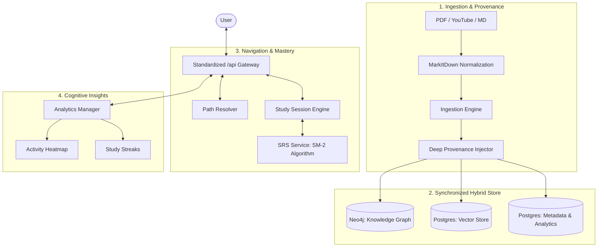

# LearnFast Core: Technical Whitepaper

## 1. Executive Summary
LearnFast Core is a high-performance pedagogical engine designed to close the loop between raw information and long-term knowledge retention. By integrating AI-driven ingestion, hybrid graph-vector reasoning, and evidence-based learning strategies (SRS), LearnFast Core provides a complete ecosystem for converting unstructured data into structured mastery.

The system provides a holistic learning lifecycle: **Ingest** (Multi-modal normalization), **Structure** (Knowledge Graph & Provenance), **Navigate** (Budget-Aware Paths), **Master** (Spaced Repetition & Study Sessions), and **Analyze** (Retention Metrics & Gamification).

## 2. System Architecture: The Learning Lifecycle
The architecture is built as a series of specialized engines that ensure data integrity and pedagogical effectiveness.

## 3. Storage & Integrity: Deep Provenance
LearnFast Core utilizes a synchronized multi-store strategy to maintain perfect consistency.

### 3.1 Knowledge Graph (Neo4j)
Atomic "Concept Nodes" are linked via directed prerequisite edges. Each node and relationship is tagged with **Deep Provenance**, a registry of contributing documents. This enables **Synchronized Distributed Deletion**: removing a source document automatically prunes the graph of any orphaned knowledge, ensuring the curriculum remains a living reflection of the current library.

### 3.2 Hybrid Vector Search (pgvector)
Content is embedded as semantic chunks and stored in PostgreSQL using the `pgvector` extension. This allows for hyper-local retrieval, allowing the system to surface the exact paragraph needed to explain a concept encountered in a learning path.

## 4. Operational Intelligence
### 4.1 Budget-Aware Path Resolution
The `PathResolver` calculates the optimal pedagogical route from a learner's frontier to their target goal. Unlike standard graph traversals, it is **Constraint-Aware**:
- **Time Estimation**: Predicts study time based on chunk density, using baseline estimates for concepts with sparse content to prevent "free" paths.
- **Robust Budget Pruning**: Intelligently truncates paths to fit time limits, suggesting intermediate "Sub-Goals" to maintain motivation and ensure every session is achievable.

### 4.2 Spaced Repetition (SRS)
To ensure long-term retention, LearnFast Core implements a native **SRS Service** based on the **SM-2 Algorithm**.
- **Recall Ratings**: Users rate their recall (0-5) during study sessions.
- **Adaptive Scheduling**: The system recalculates "Ease Factors" and intervals, forecasting future review dates to optimize the forgetting curve.

## 5. AI-Driven Mastery Tools
Beyond navigation, the engine actively creates study material:
- **Flashcard Harvesting**: LLMs extract key-value pairs (Front/Back) from documents.
- **Question Generation**: Creating multiple-choice questions to test comprehension on the fly.
- **Lesson Extraction**: Automatically assembling markdown modules based on resolved learning paths, with **Math-Aware Rendering** (via KaTeX) to preserve complex notation.

## 6. Organization & Analytics
### 6.1 Hierarchical Management
Documents are organized into a rich folder system featuring custom colors and icons, supporting bulk movement and unfiling operations.

### 6.2 Cognitive Insights (Heatmaps & Metics)
The `AnalyticsManager` provides a dashboard of learning health:
- **Study Heatmaps**: Visualizing activity consistency over a year.
- **Retention Rates**: Tracking successful vs. failed reviews.
- **SRS Distribution**: A breakdown of the library from New to Mastered cards.
- **Progress Tracking**: Real-time reading progress, time-on-page tracking, and completion estimates.

## 7. Security & Privacy
Designed for local-first reliability, the entire stack—from Neo4j to the LLM (via Ollama)—can be deployed in air-gapped environments. API access is strictly governed by a standardized `/api` prefix, ensuring secure and predictable front-end integration.

---
*LearnFast Core: Structure for your Knowledge.*
